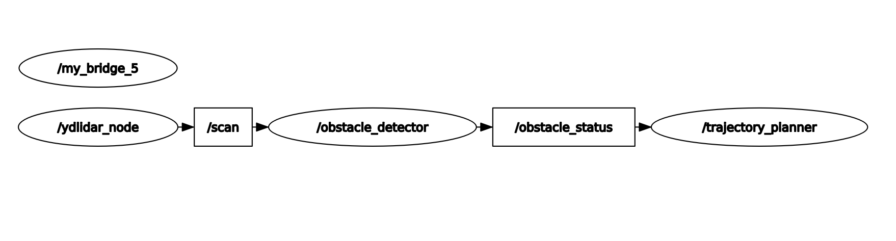

# KS Obstacle Detection

The Obstacle Detection node uses Lidar data to detect obstacles within a specified range and angular region of interest (ROI). The node subscribes to the /scan topic, which provides raw LiDAR data in the form of a LaserScan message. By analyzing this data, the node identifies obstacles within a detection range of 0.65 meters (Updated on a trial and error basis), specifically in the angular range from -90° to -30° (There is shift in the origin angle of the lidar by 60 degrees) relative to the robot's forward-facing direction.

This component is written to satisfy the Module 5 Criteria 3 (Host Vehicle Detects Obstacles in Front) User Story 1

# M5.3.1 - Host Vehicle Detects Obstacles in Front

As the obstacle detection component of the host vehicle,
I want the vehicle to detect obstacles using the LiDAR sensor,
so that the trajectory planner can respond appropriately whenever an obstacle is present.

### Acceptance Criteria:
1. [x] The obstacle detection component must subscribe to the `/scan` topic with the LiDAR data.
2. [x] The component must filter and analyze LiDAR data specifically within:
       - Angular range: -90° to -30°
       - Radius range: 0.6m from the LiDAR sensor.
3. [x] A `/masked_scan` topic must be published:
       - Masked LiDAR data where ranges outside the Region of Interest (ROI) are set to infinity for visualization.
4. [x] An obstacle status must be published on the `/obstacle_status` topic:
       - True : Obstacle detected within the defined ROI and range.
       - False : No obstacle detected.
5. [x] The system must provide clear log messages to indicate whether obstacles are detected 
       within the specified ROI and range.


## Input

|       | Topic | Message   | Description                               |
|-------|-------|-----------|-------------------------------------------|
| Input |/scan| [sensor_msgs/msg/LaserScan.msg](https://github.com/ros2/common_interfaces/blob/rolling/sensor_msgs/msg/LaserScan.msg)  | LiDAR scan data providing distance measurements across a 360° field of view |

## Processing

### ROI (Region of Interest) Filtering
- The angular range of interest is set between -90° to -30° relative to the forward direction of the robot. This range is calculated using:
    - angle_min and angle_increment fields in the /scan message.
    - Index boundaries are computed using:
        ```
        index_min = ceil((-pi/2 - angle_min) / angle_increment)
        index_max = floor((-pi/6 - angle_min) / angle_increment)
        ```

### Obstacle Detection
- Distances in the ranges array within the ROI are analyzed.
- If any distance is less than 0.6 meters and greater than 0, an obstacle is detected.

### Masked Scan Creation
- A masked LaserScan message is created:
- All ranges outside the ROI are set to inf (infinity).
- Distances within the ROI are retained for visualization purposes.

### Obstacle Status
Publishes a flag indicating obstacle detection:
- 1: Obstacle detected within the specified ROI and range.
- 0: No obstacle detected.

## Output

|        | Topic | Message | Description                     |
|--------|-------|---------|---------------------------------|
| Output |/obstacle_status| [std_msgs/msg/Bool.msg](https://github.com/ros2/common_interfaces/blob/rolling/std_msgs/msg/Int8.msg) | Publishes detection status: 0 (no obstacle) or 1 (obstacle detected)|
| Output (Only for visualization) |/masked_scan| [sensor_msgs/msg/LaserScan.msg](https://github.com/ros2/common_interfaces/blob/rolling/sensor_msgs/msg/LaserScan.msg) | LaserScan message with distances masked outside the ROI for visualization|

## Block Diagram
<div align="center">
    
</div>

## Installation

1. Initially for setting up the enivonment, Clone this repository
```
git clone https://git.hs-coburg.de/KickStart/ks_obstacle_detection

```
2. Build the package in workspace and source the file. Ensure to source each and every terminals in use. 
```
colcon build --packages-select ks_obstacle_detection
source install/setup.bash
```
3. start new terminal, run the lidar node
```
ros2 run ydlidar ydlidar_node
```
4. start new terminal, run the subscriber node
```
ros2 run ks_obstacle_detection obstacle_detector
```
5. For viewing the published message, run the command below
```
ros2 topic echo /obstacle_status
```
6. For visualizing /masked_scan topic, use the command below
```
rviz2
```
7. For visualizing publisher and subscriber node, use the command below
```
rqt
```

## Test Cases
The following test cases are designed to validate the functionality of the object detection component. By running the test script, it can be ensured that the component behaves as expected under different scenarios, such as subscribing to sensor data topics, processing input data within the defined region of interest (ROI), detecting and classifying objects, publishing detection results, handling edge cases like invalid or missing data, and logging appropriate warnings or errors. These tests ensure robust and accurate performance of the object detection system under various operating conditions.

For checking the test cases, run the code below
```
python -m pytest -v test/test_obstacle_detection.py
```
For test and coverage report to be included
```
python3 -m pytest --cov=ks_obstacle_detection --cov-report html:./test/reports/html_cov        --cov-report xml:./test/reports/coverage.xml        --html=./test/reports/test_report.html --self-contained-html -v test/test_obstacle_detection.py
```

<div align="center">
    
</div>

### RQT Node Graph
<div align="center">
    
</div>
